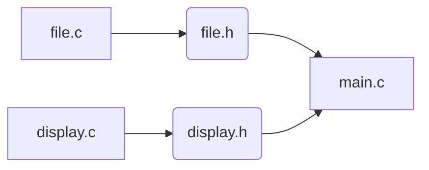

# Description
This project is a implementation of the [Conway's Game of Life cellular automaton](https://en.wikipedia.org/wiki/Conway%27s_Game_of_Life).

The program was made in the C language, using the SDL Graphic library.

# Installation
The following packages are required to execute the game :  `libsdl-dev`, `libsdl-ttf2.0-dev`

```
sudo apt install libsdl-dev libsdl-ttf2.0-dev
```

To generate the executable file 'lifegame' use :
```
make
```

# Usage
The board can be generated randomly, loaded from a file or started blank.

```
lifegame [-h] [-n \<size>] [-f \<file>] [-r \<type>]
```
### Params
&nbsp;__-h__

&nbsp;&nbsp;&nbsp;Display a help page

 &nbsp;__-f \<file>__

&nbsp;&nbsp;&nbsp;Load a board from a file
&nbsp;&nbsp;&nbsp;The first line of the file must be the board size

&nbsp;__-n \<size>__

&nbsp;&nbsp;&nbsp;&nbsp;Define the size of the board (the board is always a square)

&nbsp;__-r \<type>__

&nbsp;&nbsp;&nbsp;&nbsp;Randomly generate the board

&nbsp;&nbsp;&nbsp;&nbsp;Random types :

&nbsp;&nbsp;&nbsp;&nbsp;&nbsp;&nbsp;&nbsp;&nbsp;&nbsp;&nbsp;1 - Full random

&nbsp;&nbsp;&nbsp;&nbsp;&nbsp;&nbsp;&nbsp;&nbsp;&nbsp;&nbsp;2 - Random with a vertical symmetry

&nbsp;&nbsp;&nbsp;&nbsp;&nbsp;&nbsp;&nbsp;&nbsp;&nbsp;&nbsp;3 - Random with a horizontal symmetry

&nbsp;&nbsp;&nbsp;&nbsp;&nbsp;&nbsp;&nbsp;&nbsp;&nbsp;&nbsp;4 - Random with both symmetries

### Command line examples
```
lifegame -n 25 -r 4
```

Generates a board of 25x25 with a double symmetry


```
lifegame -f examples/big-ship.txt
```

Loads the board from the file 'big-ship.txt'

# Project structure

The project contains 3 main files

## main.c
This file contains the main function and the argument management.
## display.c
This file uses the SDL library to display the Game of Life
## file.c
This file contains the code to manage files and board memory

# Examples
The project contains an 'example' folder which contains a list of example files.

Those are some examples of known structures in the Conway's Game of Life. They can be given to the program with the `-f` parameter

# Copyright
This project was made by Joël von der Weid.
This project is under the MIT license. See [LICENSE](LICENSE) file for more information.

